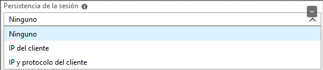

### Escuela Colombiana de Ingeniería

### Arquitecturas de Software - ARSW

## Escalamiento en Azure con Maquinas Virtuales, Sacale Sets y Service Plans

### Dependencias

- Cree una cuenta gratuita dentro de Azure. Para hacerlo puede guiarse de esta [documentación](https://azure.microsoft.com/en-us/free/search/?&ef_id=Cj0KCQiA2ITuBRDkARIsAMK9Q7MuvuTqIfK15LWfaM7bLL_QsBbC5XhJJezUbcfx-qAnfPjH568chTMaAkAsEALw_wcB:G:s&OCID=AID2000068_SEM_alOkB9ZE&MarinID=alOkB9ZE_368060503322_%2Bazure_b_c__79187603991_kwd-23159435208&lnkd=Google_Azure_Brand&dclid=CjgKEAiA2ITuBRDchty8lqPlzS4SJAC3x4k1mAxU7XNhWdOSESfffUnMNjLWcAIuikQnj3C4U8xRG_D_BwE). Al hacerlo usted contará con $200 USD para gastar durante 1 mes.

### 📍 Parte 0 - Entendiendo el escenario de calidad

Adjunto a este laboratorio usted podrá encontrar una aplicación totalmente desarrollada que tiene como objetivo calcular el enésimo valor de la secuencia de Fibonnaci.

**Escalabilidad**
Cuando un conjunto de usuarios consulta un enésimo número (superior a 1000000) de la secuencia de Fibonacci de forma concurrente y el sistema se encuentra bajo condiciones normales de operación, todas las peticiones deben ser respondidas y el consumo de CPU del sistema no puede superar el 70%.

### 📍 Parte 1 - Escalabilidad vertical

1. Diríjase a el [Portal de Azure](https://portal.azure.com/) y a continuación cree una maquina virtual con las características básicas descritas en la imágen 1 y que corresponden a las siguientes:

   - Resource Group = SCALABILITY_LAB
   - Virtual machine name = VERTICAL-SCALABILITY
   - Image = Ubuntu Server
   - Size = Standard B1ls
   - Username = scalability_lab
   - SSH publi key = Su llave ssh publica

2. Para conectarse a la VM use el siguiente comando, donde las `x` las debe remplazar por la IP de su propia VM.

   `ssh scalability_lab@xxx.xxx.xxx.xxx`

3. Instale node, para ello siga la sección _Installing Node.js and npm using NVM_ que encontrará en este [enlace](https://linuxize.com/post/how-to-install-node-js-on-ubuntu-18.04/).
4. Para instalar la aplicación adjunta al Laboratorio, suba la carpeta `FibonacciApp` a un repositorio al cual tenga acceso y ejecute estos comandos dentro de la VM:

   `git clone <your_repo>`

   `cd <your_repo>/FibonacciApp`

   `npm install`

5. Para ejecutar la aplicación puede usar el comando `npm FibinacciApp.js`, sin embargo una vez pierda la conexión ssh la aplicación dejará de funcionar. Para evitar ese compartamiento usaremos _forever_. Ejecute los siguientes comando dentro de la VM.

   `npm install forever -g`

   `forever start FibinacciApp.js`

6. Antes de verificar si el endpoint funciona, en Azure vaya a la sección de _Networking_ y cree una _Inbound port rule_ tal como se muestra en la imágen. Para verificar que la aplicación funciona, use un browser y user el endpoint `http://xxx.xxx.xxx.xxx:3000/fibonacci/6`. La respuesta debe ser `The answer is 8`.

7. La función que calcula en enésimo número de la secuencia de Fibonacci está muy mal construido y consume bastante CPU para obtener la respuesta. Usando la consola del Browser documente los tiempos de respuesta para dicho endpoint usando los siguintes valores:

   - 1000000
   - 1010000
   - 1020000
   - 1030000
   - 1040000
   - 1050000
   - 1060000
   - 1070000
   - 1080000
   - 1090000

8. Dírijase ahora a Azure y verifique el consumo de CPU para la VM. (Los resultados pueden tardar 5 minutos en aparecer).

9. Ahora usaremos Postman para simular una carga concurrente a nuestro sistema. Siga estos pasos.

   - Instale newman con el comando `npm install newman -g`. Para conocer más de Newman consulte el siguiente [enlace](https://learning.getpostman.com/docs/postman/collection-runs/command-line-integration-with-newman/).
   - Diríjase hasta la ruta `FibonacciApp/postman` en una maquina diferente a la VM.
   - Para el archivo `[ARSW_LOAD-BALANCING_AZURE].postman_environment.json` cambie el valor del parámetro `VM1` para que coincida con la IP de su VM.
   - Ejecute el siguiente comando.

   ```
   newman run ARSW_LOAD-BALANCING_AZURE.postman_collection.json -e [ARSW_LOAD-BALANCING_AZURE].postman_environment.json -n 10 &
   newman run ARSW_LOAD-BALANCING_AZURE.postman_collection.json -e [ARSW_LOAD-BALANCING_AZURE].postman_environment.json -n 10
   ```

10. La cantidad de CPU consumida es bastante grande y un conjunto considerable de peticiones concurrentes pueden hacer fallar nuestro servicio. Para solucionarlo usaremos una estrategia de Escalamiento Vertical. En Azure diríjase a la sección _size_ y a continuación seleccione el tamaño `B2ms`.
11. Una vez el cambio se vea reflejado, repita el paso 7, 8 y 9.
12. Evalue el escenario de calidad asociado al requerimiento no funcional de escalabilidad y concluya si usando este modelo de escalabilidad logramos cumplirlo.

      Usando este modelo de escalabilidad logramos reducir el consumo de CPU y tiempo de respuesta a las peticiones evidenciadas en la consola del browser; sin embargo aún falla nuestro servicio pues no responde con éxito a un conjunto considerable de peticiones concurrentes.

13. Vuelva a dejar la VM en el tamaño inicial para evitar cobros adicionales.

#### 💡 Evidencia conexión con ssh a la VM creada y ejecución en el browser

<!DOCTYPE html>
<html>
    <head></head>
    <body>
        
    </body>
</html>

<!DOCTYPE html>
<html>
    <head></head>
    <body>
        
    </body>
</html>

**🔎 Preguntas**

1. **¿Cuántos y cuáles recursos crea Azure junto con la VM?**

Junto con la máquina virtual,Azure crea 6 recursos:
   * Azure Storage Account
   * Public IP Address
   * Network Interface
   * Virtual Network
   * Virtual Disks
   * Network Security Group
  
2. ¿Brevemente describa para qué sirve cada recurso?
3. ¿Al cerrar la conexión ssh con la VM, por qué se cae la aplicación que ejecutamos con el comando `npm FibonacciApp.js`? ¿Por qué debemos crear un _Inbound port rule_ antes de acceder al servicio?
4. Adjunte tabla de tiempos e interprete por qué la función tarda tando tiempo.
5. Adjunte imágen del consumo de CPU de la VM e interprete por qué la función consume esa cantidad de CPU.
6. Adjunte la imagen del resumen de la ejecución de Postman. Interprete:
   - Tiempos de ejecución de cada petición.
   - Si hubo fallos documentelos y explique.
7. ¿Cuál es la diferencia entre los tamaños `B2ms` y `B1ls` (no solo busque especificaciones de infraestructura)?
8. ¿Aumentar el tamaño de la VM es una buena solución en este escenario?, ¿Qué pasa con la FibonacciApp cuando cambiamos el tamaño de la VM?
9. ¿Qué pasa con la infraestructura cuando cambia el tamaño de la VM? ¿Qué efectos negativos implica?
10. ¿Hubo mejora en el consumo de CPU o en los tiempos de respuesta? Si/No ¿Por qué?
11. Aumente la cantidad de ejecuciones paralelas del comando de postman a `4`. ¿El comportamiento del sistema es porcentualmente mejor?

### 📍 Parte 2 - Escalabilidad horizontal

#### Crear el Balanceador de Carga

Antes de continuar puede eliminar el grupo de recursos anterior para evitar gastos adicionales y realizar la actividad en un grupo de recursos totalmente limpio.

1. El Balanceador de Carga es un recurso fundamental para habilitar la escalabilidad horizontal de nuestro sistema, por eso en este paso cree un balanceador de carga dentro de Azure tal cual como se muestra en la imágen adjunta.


2. A continuación cree un _Backend Pool_, guiese con la siguiente imágen.


3. A continuación cree un _Health Probe_, guiese con la siguiente imágen.


4. A continuación cree un _Load Balancing Rule_, guiese con la siguiente imágen.


5. Cree una _Virtual Network_ dentro del grupo de recursos, guiese con la siguiente imágen.


#### Crear las maquinas virtuales (Nodos)

Ahora vamos a crear 3 VMs (VM1, VM2 y VM3) con direcciones IP públicas standar en 3 diferentes zonas de disponibilidad. Después las agregaremos al balanceador de carga.

1. En la configuración básica de la VM guíese por la siguiente imágen. Es importante que se fije en la "Avaiability Zone", donde la VM1 será 1, la VM2 será 2 y la VM3 será 3.


2. En la configuración de networking, verifique que se ha seleccionado la _Virtual Network_ y la _Subnet_ creadas anteriormente. Adicionalmente asigne una IP pública y no olvide habilitar la redundancia de zona.


3. Para el Network Security Group seleccione "avanzado" y realice la siguiente configuración. No olvide crear un _Inbound Rule_, en el cual habilite el tráfico por el puerto 3000. Cuando cree la VM2 y la VM3, no necesita volver a crear el _Network Security Group_, sino que puede seleccionar el anteriormente creado.


4. Ahora asignaremos esta VM a nuestro balanceador de carga, para ello siga la configuración de la siguiente imágen.


5. Finalmente debemos instalar la aplicación de Fibonacci en la VM. para ello puede ejecutar el conjunto de los siguientes comandos, cambiando el nombre de la VM por el correcto

```
git clone https://github.com/daprieto1/ARSW_LOAD-BALANCING_AZURE.git

curl -o- https://raw.githubusercontent.com/creationix/nvm/v0.34.0/install.sh | bash
source /home/vm1/.bashrc
nvm install node

cd ARSW_LOAD-BALANCING_AZURE/FibonacciApp
npm install

npm install forever -g
forever start FibonacciApp.js
```

Realice este proceso para las 3 VMs, por ahora lo haremos a mano una por una, sin embargo es importante que usted sepa que existen herramientas para aumatizar este proceso, entre ellas encontramos Azure Resource Manager, OsDisk Images, Terraform con Vagrant y Paker, Puppet, Ansible entre otras.

#### Probar el resultado final de nuestra infraestructura

1. Porsupuesto el endpoint de acceso a nuestro sistema será la IP pública del balanceador de carga, primero verifiquemos que los servicios básicos están funcionando, consuma los siguientes recursos:

```
http://52.155.223.248/
http://52.155.223.248/fibonacci/1
```

2. Realice las pruebas de carga con `newman` que se realizaron en la parte 1 y haga un informe comparativo donde contraste: tiempos de respuesta, cantidad de peticiones respondidas con éxito, costos de las 2 infraestrucruras, es decir, la que desarrollamos con balanceo de carga horizontal y la que se hizo con una maquina virtual escalada.

3. Agregue una 4 maquina virtual y realice las pruebas de newman, pero esta vez no lance 2 peticiones en paralelo, sino que incrementelo a 4. Haga un informe donde presente el comportamiento de la CPU de las 4 VM y explique porque la tasa de éxito de las peticiones aumento con este estilo de escalabilidad.

```
newman run ARSW_LOAD-BALANCING_AZURE.postman_collection.json -e [ARSW_LOAD-BALANCING_AZURE].postman_environment.json -n 10 &
newman run ARSW_LOAD-BALANCING_AZURE.postman_collection.json -e [ARSW_LOAD-BALANCING_AZURE].postman_environment.json -n 10 &
newman run ARSW_LOAD-BALANCING_AZURE.postman_collection.json -e [ARSW_LOAD-BALANCING_AZURE].postman_environment.json -n 10 &
newman run ARSW_LOAD-BALANCING_AZURE.postman_collection.json -e [ARSW_LOAD-BALANCING_AZURE].postman_environment.json -n 10
```

**🔎 Preguntas**

1. **¿Cuáles son los tipos de balanceadores de carga en Azure y en qué se diferencian?**

   Azure Load Balancer puede configurarse como un balanceador interno o público:

   **Interno: Tendrá una IP privada y no será accesible desde Internet. Igual que en el público, las peticiones que lleguen a la IP del frontend se distribuirán entre las máquinas del backend.**

   - Uso frecuente para equilibrar el tráfico procedente de direcciones IP privadas.
   - Se utiliza cuando se necesitan IPs privadas sólo en el frontend.
   - Los balanceadores de carga internos (o privados) se utilizan para equilibrar la carga del tráfico dentro de una red virtual. Se puede acceder a un balanceador de carga frontend desde una red local en un escenario híbrido.

   **Público : Tendrá una IP pública en el frontend en la que recibirá peticiones que repartirá entre las máquinas del backend.**

   - Uso frecuente para equilibrar el tráfico procedente de direcciones IP públicas.
   - Tiene la capacidad de proporcionar conexiones salientes para máquinas virtuales (VM) dentro de su red virtual. Estas conexiones se realizan traduciendo sus direcciones IP privadas a direcciones IP públicas.
   - Los balanceadores de carga públicos se utilizan para equilibrar la carga del tráfico de Internet a sus máquinas virtuales.

2. **¿Qué es SKU, qué tipos hay y en qué se diferencian?**

   **SKU (Stock Keeping Unit)** podemos seleccionar entre Básico y Estándar. Cualquier configuración que podamos hacer con un Load Balancer Básico también la podemos hacer con un Load Balancer Estándar, pero este último incluye algunas características que no estén en el básico:

   - Hasta 1.000 instancias de máquinas virtuales en el backend frente a 100 que permite como máximo el básico.
   - Sondas de salud TCP, HTTP y HTTPS, mientras que el básico sólo permite sondas de tipo TCP y HTTP, pero no HTTPS.
   - Uso de zonas de disponibilidad, lo que no es posible en el básico.

   **Standard**

   - El balanceador de carga estándar se basa en el modelo de seguridad de red de confianza cero.
   - El balanceador de carga estándar es seguro por defecto y forma parte de su red virtual. La red virtual es una red privada y aislada.
   - Los balanceadores de carga estándar y las direcciones IP públicas estándar están cerrados a las conexiones entrantes a menos que se abran mediante Grupos de Seguridad de Red. Los NSG se utilizan para permitir explícitamente el tráfico permitido. Si no tiene un NSG en una subred o NIC de su recurso de máquina virtual, no se permite que el tráfico llegue a este recurso.

   **Basic:** El balanceador de carga básico está abierto a Internet por defecto.

3. **¿Por qué el balanceador de carga necesita una IP pública?**

   Las máquinas virtuales se conectan al backend del balanceador de carga y la dirección **IP pública** se asigna al frontend. También implementa el servicio de NAT. El NAT inverso recibe la petición en la IP pública y la redirige a la máquina que el algoritmo considere como óptima en cada momento.

   - Se utilizará en la configuración de la IP del frontend.
   - Para acceder a las máquinas virtuales en una red virtual por dirección IP pública y puerto.

4. **¿Cuál es el propósito del _Backend Pool_?**

   **Propósito: Contiene las direcciones IP de las máquinas virtuales (NICs) conectadas al balanceador de carga.**

   Definir el grupo de recursos que servirá el tráfico para una determinada regla de balanceo de carga. Si se configura un pool de backend por Tarjeta de interfaz de red (NIC); este método crea el vínculo más directo entre su recurso y el conjunto de backend.

5. **¿Cuál es el propósito del _Health Probe_?**

   **Propósito: Supervisar el estado de su aplicación.**

   Se configura un Health Probe que el balanceador de carga puede utilizar para determinar si su instancia está en buen estado. Si su instancia falla en su Health Probe suficientes veces, dejará de recibir tráfico hasta que empiece a pasar Health Probe de nuevo.

   Es decir, se usan para detectar el fallo de una aplicación en un endpoint del backend; Las respuestas de Health Probe determinan qué instancias del backend pool recibirán nuevos flujos.

6. **¿Cuál es el propósito de la _Load Balancing Rule_?**

   **Propósito: Definir cómo se distribuye el tráfico a las máquinas virtuales dentro del pool de backend.**

   Se define la configuración de IP del frontend para el tráfico entrante y el pool de IP del backend para recibir el tráfico. El puerto de origen y destino se definen en la regla.

7. **¿Qué tipos de sesión persistente existen, por qué esto es importante y cómo puede afectar la escalabilidad del sistema?.**

   Podríamos aplicar persistencia a la sesión, de forma que un cliente siempre sería dirigido a la misma máquina del backend. Las opciones de persistencia son:

   

   - **Ninguno:** Sucesivas peticiones de un mismo cliente podrían ser atendidas por máquinas diferentes del backend.
   - **IP del cliente:** Todas las peticiones que procedan de una misma IP de origen serás atendidas por la misma máquina del backend.
   - **IP y protocolo del cliente:** Todas las peticiones que procedan de una misma IP y puerto de origen serán atendidas por la misma máquina del backend, pero si vienen de la misma IP pero con un puerto de origen diferente podrían ser atendidas por otra máquina del backend.

   Cuando se habla del equilibrio de carga, ‘persistencia’ se refiere a la información que se transfiere a través de múltiples solicitudes durante la sesión de un usuario.

   Parte de la información de la sesión se almacena en el navegador; artículos agregados a la cesta de la compra de un usuario en un sitio de comercio electrónico, por ejemplo. Pero cuando la información de la sesión se almacena en el servidor, por ejemplo, cuando el usuario procede al pago e inicia sesión en su cuenta, la persistencia se vuelve un poco más complicada.

   Si las solicitudes de un usuario se conectan inicialmente a un servidor que almacena información de sesión localmente, pero las solicitudes posteriores van a otros servidores en el clúster, la información de la sesión ya no estará disponible.

   Esto afecta a la disponibilidad y el rendimiento del sistema.

8. **¿Qué es una _Virtual Network_? ¿Qué es una _Subnet_? ¿Para qué sirven los _address space_ y _address range_?**

   **Azure Virtual Network (VNet)** es el bloque de construcción fundamental para su red privada en Azure. VNet permite que muchos tipos de recursos de Azure, como las máquinas virtuales (VM) de Azure, se comuniquen de forma segura entre sí, con Internet y con las redes locales. VNet es similar a una red tradicional que operaría en su propio centro de datos, pero trae consigo beneficios adicionales de la infraestructura de Azure, como la escala, la disponibilidad y el aislamiento.

   The Virtual Network de Azure permite que los recursos de Azure se comuniquen de forma segura entre sí, con Internet y con las redes locales. Los escenarios clave que puede lograr con una red virtual incluyen: la comunicación de los recursos de Azure con Internet, la comunicación entre los recursos de Azure, la comunicación con los recursos locales, el filtrado del tráfico de red, el enrutamiento del tráfico de red y la integración con los servicios de Azure.

   Una **Subnet** es un rango de direcciones IP en la VNet. Se puede dividir una VNet en varias subnets para su organización y seguridad. Cada NIC en una VM está conectada a una subred en una VNet. Las NICs conectadas a subredes (iguales o diferentes) dentro de una VNet pueden comunicarse entre sí sin ninguna configuración adicional.

   **Address space** de una red virtual se compone de uno o varios rangos de direcciones no superpuestos que se especifican en notación CIDR.
   
   **Address range** debe ser especificado en notación CIDR, y no puede superponerse con otros rangos de direcciones dentro de la misma red virtual o Subnet.

9. **¿Qué son las _Availability Zone_ y por qué seleccionamos 3 diferentes zonas?.**

   Una **Availability Zone** es una oferta de alta disponibilidad que protege sus aplicaciones y datos de los fallos del centro de datos. Las zonas de disponibilidad son ubicaciones físicas únicas dentro de una región de Azure. Cada zona se compone de uno o más centros de datos equipados con energía, refrigeración y redes independientes. Para garantizar la resistencia, hay un mínimo de tres zonas separadas en todas las regiones habilitadas. La separación física de las zonas de disponibilidad dentro de una región protege las aplicaciones y los datos de los fallos del centro de datos.

10. **¿Qué significa que una IP sea _zone-redundant_?**

      Los servicios de **zone-redundant** replican sus aplicaciones y datos a través de las zonas de disponibilidad para protegerlos de los puntos únicos de fallo. Con las zonas de disponibilidad, Azure ofrece el mejor acuerdo de nivel de servicio (SLA) del sector con un 99,99% de tiempo de actividad de las máquinas. El SLA completo de Azure explica la disponibilidad garantizada de Azure en su conjunto.

      Las puertas de enlace de **zone-redundant** y las puertas de enlace de zona se basan en el recurso de IP pública de Azure SKU estándar. La configuración del recurso de IP pública de Azure determina si la puerta de enlace que implementa es redundante por zonas o zonal.

11. **¿Cuál es el propósito del _Network Security Group_?**

      **Propósito: Línea de defensa en la seguridad de nuestros recursos en Azure.**

      - Filtra el tráfico de red hacia y desde los recursos de Azure en una red virtual de Azure.
      - Contiene reglas de seguridad que permiten o deniegan el tráfico de red entrante hacia, o el tráfico de red saliente desde, varios tipos de recursos de Azure.

12. **Informe de newman 1 (Punto 2)**
13. **Presente el Diagrama de Despliegue de la solución.**

**Fuentes:**

- https://azurebrains.com/2019/02/07/azure-load-balancer/
- https://docs.microsoft.com/en-us/azure/load-balancer/
- https://www.hostdime.com.ar/blog/por-que-usar-un-equilibrador-de-carga-o-load-balancer/
- https://docs.microsoft.com/en-us/azure/vpn-gateway/about-zone-redundant-vnet-gateways
- https://docs.microsoft.com/en-us/azure/virtual-network/network-security-group-how-it-works
